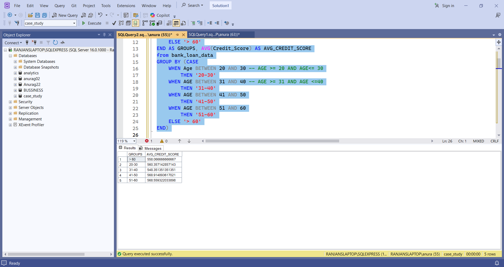
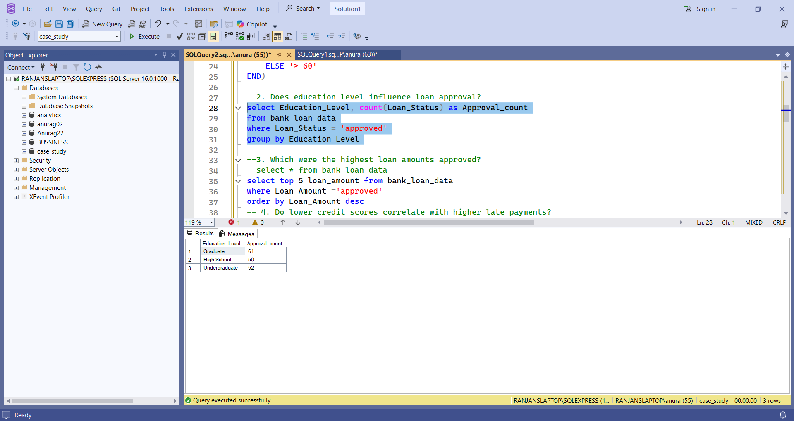
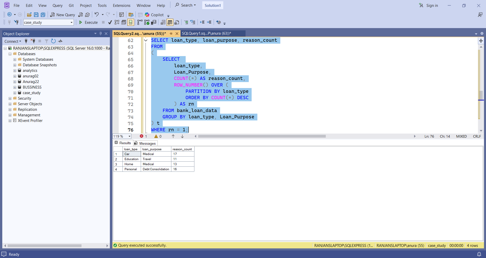

# Bank Loan Data Analysis (SQL Project)

## Project Overview

This project analyzes banking loan data using SQL to understand credit score patterns, loan approvals, and default risks.

## Tools Used

* SQL Server
* SQL Server Management Studio (SSMS)

## Business Questions

1. Credit score trend across different age groups
2. Does education level influence loan approval?
3. Which were the highest loan amounts approved?
4. Do lower credit scores correlate with higher late payments?
5. Which customers have a high EMI burden relative to their income?
6. Do longer loan terms lead to higher default rates?
7. Is there a gender-based difference in loan default rates?
8. Which loan types carry the highest monthly repayment burdens?
9.  What are the most frequent reasons customers apply for loans for each loan type?
10. How does default rate vary across employment statuses (e.g., unemployed vs employed)?

## Query Results

### Credit Score Trend by Age Group

### Education level vs Loan approval

### frequent reasons customers apply for loans vs loan type

## Project Files

* bank_loan_sql analysis.txt
* bank-loan-sql-_analysis.xlsx

